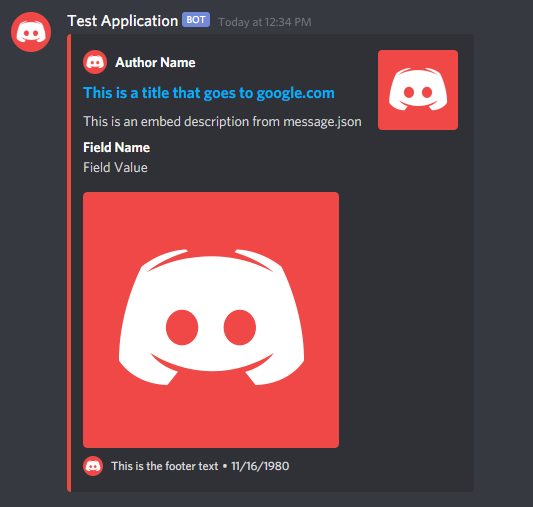
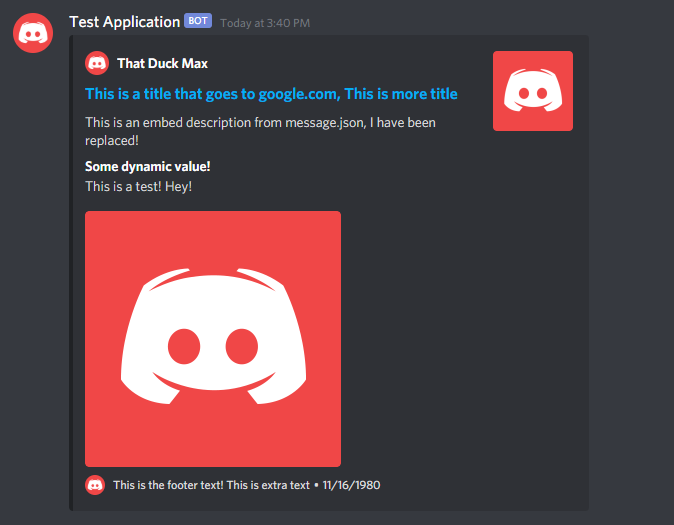

[](https://discord.gg/jUNbV5u)
[](https://discord.gg/jUNbV5u)
[](https://www.npmjs.com/package/cdcommands)
[](https://www.npmjs.com/package/cdcommands)
[](https://www.npmjs.com/package/cdcommands)
[](https://github.com/CreativeDevelopments/CDCommands)

# Table of Contents

- [Installation](#installation)
- [Initial Setup](#initial-setup)
- [Creating a Basic Command](#creating-a-basic-command)
  - [Command Properties](#command-properties)
    - [Argument Validation](#argument-validation)
      - [Validate](#the-validate-function)
      - [On Error](#the-onerror-function)
      - [On Success](#the-onsuccess-function)
  - [Default Commands](#default-commands)
    - [Help Command](#help-command)
    - [Prefix Command](#prefix-command)
    - [Language Command](#language-command)
    - [Roles Command](#roles-command)
    - [Commands Command](#commands-command)
    - [Categories Command](#categories-command)
- [Creating an Event](#creating-an-event)
- [Creating a Feature](#creating-a-feature)
- [Default Responses](#default-responses)
  - [Fetching Values](#fetching-values)
  - [Embeds](#embeds)
  - [Replacers](#replacers)
    - [String Replacers](#string-replacers)
    - [Embed Replacers](#embed-replacers)
  - [Language Support](#language-support)
    - [Changing Your Language](#changing-your-language)
    - [Adding a New Language](#adding-a-new-language)
    - [Dynamic Language Support](#dynamic-language-support)
- [Client Utils](#client-utils)
- [Other](#other)

# Installation

To avoid unwanted warnings with mongoose/mongodb, we recommend installing a previous version (v5.11.15) or waiting until this issue is fixed in the next release.

```
$ npm install mongoose@5.11.15
$ npm install cdcommands
```

# Initial Setup

To setup your bot project with CDCommands, all you need to do is initialize the main class inside of your client ready event!

```js
const { Client } = require("discord.js");
const CDCommands = require("cdcommands");

const client = new Client();

client.on("ready", () => {
  new CDCommands(client, {
    // Path to your commands folder (default: "commands")
    commandsDir: "commands",
    // Path to your events folder (default: "events")
    eventsDir: "events",
    // Path to your features folder (default: "features")
    featuresDir: "features",
    // Path to message.json file (default: inside node_modules folder)
    MessageJSONPath: "message.json",
    // An array of your test servers (default: [])
    testServers: [],
    // Array of bot developers (default: [])
    devs: [],
    // The default prefix you wish to set
    defaultPrefix: "?",
    // Your mongodb connection uri
    mongoURI: "URI_HERE",
    // How frequently the cache will update the database (default: 90 seconds)
    cacheUpdateSpeed: 60000 * 5,
    // What default commands you want to "disable" or not load (default: [])
    disabledDefaultCommands: [],
    // Whether or not you want to make your own message event (default: false)
    customMessageEvent: false,
  });

  console.log(`${client.user.username} has logged in!`);
});

client.login("BOT_TOKEN");
```

As long as you set everything up correctly, this should be all you technically need to get a barebones bot up and running.

# Creating a Basic Command

Your commands folder, in this documentations case is "commands", may have as many subfolders as you wish, the handler will search through each folder and load any command that it encounters. There are six commands that are loaded by default, and these can be picked to not load in the main class under the "disabledDefaultCommands" property. Although, this is not recommended as it will remove some of the bots basic functionality, unless of course, you want to make your own versions of the command. More information about each command under [Default Commands](#default-commands) <br>

> Note: _Commands **must** be an instance of the Command class, or they will not be loaded._ A bonus of using the class is that you get powerful intellisense both while setting up your command and while creating your "run" function!

To create a command, all you need is a new file in your commands directory and the Commands class from the package, then all you need to do is export a new instance of the class and you're done! New command!

```js
// ./commands/Ping.js
const { Command } = require("cdcommands");

module.exports = new Command();
```

Now, obviously, this command wont work, as there are no properties associated with it, so therefore your bot cant find the command or execute it in any way. So now we will need to add some properties to this command so your bot can both recognize the command and execute its function.

## Command Properties

The command class has many different properties that can help you get the most out of this handlers capabilities and to allow your bot to find and execute all the commands you create.<br>
We will also be requiring a new class from the module called "Validator", read on to learn more.

```js
// ./commands/Ping.js

const { Command, Validator } = require("cdcommands");

module.exports = new Command({
  // The commands main name. Used to find the command. (type: string)
  name: "ping",
  // An array of command aliases that can also be used to find and
  // execute the command. (type: Array<string>)
  aliases: ["pong"],
  // The category the command fits into. This is used to sort commands
  // for the help menu. (type: string)
  category: "general",
  // A short description of the command that is used in help menus
  // (type: string)
  description: "Gets the bots connection latency",
  // A more detailed description of what the command does, also is
  // used in help menus. (type: string)
  details: "View the bots current websocket and message latency",
  // The minimum number of arguments the command expects (type: number)
  minArgs: 0,
  // The maximum number of arguments the command expects (type: number)
  // Tip: Use Infinity for no maximum
  maxArgs: Infinity,
  // The expected usage of the command. Has no functionality other than
  // being displayed in the help menu. (type: string)
  // Tip: Use ? to display the current guild prefix
  usage: "?ping",
  // Whether or not the command can be used only in a guild or not.
  // (type: boolean)
  guildOnly: false,
  // Whether or not the command can only be used in direct messages.
  // (type: boolean)
  // Tip: Set both guildOnly and dmOnly to true to "disable" a command.
  dmOnly: false,
  // Whether or not the command is NSFW, and can only be used in such
  // channels (type: boolean)
  nsfw: false,
  // Whether or not the command can only be used by the developers
  // specified in the "dev" array. (type: boolean)
  devOnly: false,
  // Whether or not the command can be disabled by the default disable
  // command (type: boolean)
  noDisable: false,
  // The amount of time until the same user can use said command again
  // (in milliseconds), use "globalCooldown" for a cross-server
  // global affect. (type: number)
  // Note: Both "cooldown" and "globalCooldown" are measured in ms
  cooldown: 500,
  // The amount of time until anyone can use said command again
  // (in milliseconds), use "cooldown" for a non-cross-server local
  // affect. (type: number)
  // Tip: Use 0 on either "cooldown" or "globalCooldown" for no cooldown
  globalCooldown: 0,
  // An array of permissions that the member will need to be able to run
  // the command. Isn't used if "dmOnly" is true.
  // (type: Array<PermissionResolvable>)
  userPermissions: ["SEND_MESSAGES", "EMBED_LINKS"],
  // An array of permissions that the bot will need to be able to run
  // the command. Isn't used if "dmOnly" is true.
  // (type: Array<PermissionResolvable>)
  botPermissions: ["SEND_MESSAGES", "EMBED_LINKS"],
  // More information will be provided below. (type: Validator)
  validate: new Validator(),
  // The function that you want run when the command is used.
  // 5 different parameters are passed along for you to use.
  // message, args, client, prefix, and language
  /* (type: ({ message, args, client, prefix, language }: 
  { message: Message, args: string[], client: CDClient, prefix: string, language: string }) => Promise<unknown>) */
  run: ({ message, args, client, prefix, language }) => {
    return message.channel.send(`My latency is **${client.ws.ping}ms**!`);
  },
});
```

The above command, when run using either **?ping** or **?pong**, should have the bot respond with some message along the lines of:

> My latency is **58ms**!<br>

## Argument Validation

The "validate" property may be slightly confusing to new users, so we decided to explain it with its own section! The validate property will accept a class called "Validator", this class provides 3 functions that you can customize to your liking, _"validate", "onSuccess", and "onError"_, each performing their own actions. Out of the three, onSuccess is optional, and the other two are required for functionality.<br>

```js
// ./commands/Ping.js
const { Command, Validator } = require("cdcommands");

module.exports = new Command({
  ...commandOptions,
  validate: new Validator({
    validate: ({ message, args, client, prefix, language }) => {
      if (args[0] !== "test") return "INCORRECT_ARGS";
    },
    onError: ({ error, message, args, client, prefix, language }) => {
      if (error === "INCORRECT_ARGS")
        message.channel.send('args[0] was not equal to "test"');
    },
    onSuccess: (message) => {
      console.log('Command "ping" was run successfully!');
    },
  }),
});
```

Replacing the validate property shown previously with the one shown above will now validate your command! Now if you don't provide your first argument as "test", you will get a response saying `args[0] was not equal to "test"`. You now must run your command as **?ping test** or **?pong test**.

### The validate function

The validate function does exactly what it sounds like it will do. It validates the command in any way that you provide in the validate function. You can return either a string, as shown above, to use in your "onError" property, or return a boolean/undefined to default to a generic error code of **"INVALID_ARGUMENT"**. Whatever string is returned from the validate function is passed into the "onError" function as the parameter "error".<br>
**Parameter Types**

- `message: import("discord.js").Message`
- `args: Array<string>`
- `client: CDClient`
- `prefix: string`
- `language: keyof import("cdcommands/src/Base/Handling/Languages.json")`

### The onError function

The onError function will execute before the command is run, and terminate execution of the command. It will send whatever you wish, based on the errors created in the "validate" function. You can send whatever message you want for each error type, or just log something to your terminal. Whatever it is, it will happen before the command executes and will terminate any further execution.<br>
**Parameter Types**

- `error: string`
- `message: import("discord.js").Message`
- `args: Array<string>`
- `client: CDClient`
- `prefix: string`
- `language: keyof import("cdcommands/src/Base/Handling/Languages.json")`

### The onSuccess function

The onSuccess function is optional, and will execute before the command is run like the "onError" function, but unlike that function, this one is non-blocking, and will just execute the provided code before the command is run.<br>
**Parameter Types**

- `message: import("discord.js").Message`

## Default Commands

In CDCommands, six default commands come premade for your bots convenience, these commands consist of help, setprefix, language, requiredroles, command, and category commands. These can all be turned off or specific ones of your choosing using the "disabledDefaultCommands" property in the CDCommands class and adding each command you wish to disable to the array as a string.

> Note: It is not recommended that you disable any commands unless you know what you're doing. The command will be completely unusable if you do so. <br>

### Help Command

This command can be found [here](https://github.com/CreativeDevelopments/CDCommands/blob/main/src/Base/DefaultCommands/Help.js) in our github repository, and by default, the help command will be dynamic, and if necessary, partially reaction based. The default help command is decently basic, so if you wish to create your own, feel free to disable the command and style your own command to your own liking. The command is only there for convenience. The command is an ordinary help command, providing you with all the information you need to understand how to use the commands in your bot. The command will pull information from the properties set while creating each command.

> Usage: **?help [category/command]**

### Prefix Command

This command can be found [here](https://github.com/CreativeDevelopments/CDCommands/blob/main/src/Base/DefaultCommands/SetPrefix.js) in our github repository. The prefix command, or "setprefix" is a default command that allows members with the necessary permissions to change the servers prefix that the bot will respond to. The prefix is initially stored in cache, which is used to update the database every so often. Once the prefix is updated, the bot will stop responding to the old prefix and will only respond to the new prefix. This new prefix will be passed through each command in the run parameters just like before.

> Usage: **?setprefix <new_prefix>**

### Language Command

This command can be found [here](https://github.com/CreativeDevelopments/CDCommands/blob/main/src/Base/DefaultCommands/Language.js) in our github repository. The language allows you to change either your own language preference, or if you are the server owner, your whole servers language preference. More about languages can be found [here](#language-support). Your personal user preference on which language you want the bot to use will override the server default, and if neither are set, the bot will default to using the English responses.

> Usage: **?language <[ISO 639-1 Code](https://en.wikipedia.org/wiki/List_of_ISO_639-1_codes)>**

### Roles Command

This command can be found [here](https://github.com/CreativeDevelopments/CDCommands/blob/main/src/Base/DefaultCommands/RequiredRoles.js) in our github repository. The roles command, or "requiredroles" allows you to set roles in your server that a member requires to be able to use said command. Required roles can be set for any command, but if they are set on a command that has the property "dmOnly" set to true, they will have to affect on the command. If a member doesn't have the correct roles that you have set for the command, the command execution will terminate before the command is run.

> Usage: **?requiredroles <add/remove> <role> <command>**

### Commands Command

This command can be found [here](https://github.com/CreativeDevelopments/CDCommands/blob/main/src/Base/DefaultCommands/Commands.js) in our github repository. The commands command, though its name might be slightly confusing, is quite simple, allowing you to disable and enable different commands. Any command with the property "noDisable" set to true, will not be able to be disabled by anyone, not even bot developers. This is to prevent dumb issues like disabling the command that allows you to re-enable the same command. Disabled commands will not be able to be used by anyone.

> Usage: **?command <enable/disable> <command>**

### Categories Command

This command can be found [here](https://github.com/CreativeDevelopments/CDCommands/blob/main/src/Base/DefaultCommands/Categories.js) in our github repository. Similarly to the commands command, the category command allows you to enable and disable entire categories instead of just certain commands. Just like the commands command again, if a command is inside of a disabled category, but has the "noDisable" property set to true, the command will still work, as it is not capable of being disabled. Any command in a disabled category otherwise will not be able to be used by anyone.

> Usage: **?category <enable/disable> <category>**

# Creating an Event

To create a new event for your bot to listen to, all you need to do is create a new file in your events directory, which in this case is "events", and import the class named "Event" from the module. After that, all you need to do is export a new instance of the class and there you have it! A new event file!

```js
// ./events/messageDelete.js
const { Event } = require("cdcommands");

module.exports = new Event();
```

Now, again, of course this event wont do anything for you, so we need to add a couple properties to the class. We are going to assign an event name, which is the same as assigning an event name in your regular `<Client>#on` listener, then we will also assign a callback function, which will have your client as `CDClient` as the first parameter, followed by the parameters that the regular listener has.

> Note: Event files **must** use the Event class or else they will not be loaded. A bonus of using the class is that you get powerful intellisense as if you were using a regular client listener!

```js
// ./events/messageDelete.js
const { Event } = require("cdcommands");

module.exports = new Event("messageDelete", (client, message) => {
  console.log(
    `${client.user.username} saw ${message.author.username} delete ${message.content}`,
  );
});
```

The above event, once your bot logs in, should log a message along the lines of `Application Name saw User delete Test` every time a user that the bot has access to deletes a message from any channel the bot can see. Since we are using the "messageDelete" event in this example, the parameters in the callback function are expected to be first your client, then followed by the message object that was deleted.

> Note: A message event file is loaded by default to allow all the different checks for permissions and others to work. The loading of this event can be disabled by setting the "customMessageEvent" property to **true** in the CDCommands class, though it is not recommended as it will break a lot of your commands functionality. If you want to make your own message event you can use this template [here](https://sourceb.in/XpAciGMZsM)

# Creating a Feature

Features are quite simple, they are loaded and run one time before your bot starts, but after all your commands and events load in. As of now there is no way to re-run features after startup, but there may be sometime in the future. Creating a Feature is extremely simple, just like everything else so far. All you need to do is create a new file in your features directory, in this case it will be "features". This file can have whatever name you like, and all you need to do is import the "Feature" class from the module, and export a new instance of the class.

```js
// ./features/file_name.js
const { Feature } = require("cdcommands");

module.exports = new Feature();
```

Just like with your commands and your events, a feature set up in this way will do nothing for you. All we need to do to set it up is add a single callback function as a parameter in the class. This callback function will have a single parameter in it, which will be the client as CDClient.

```js
// ./features/file_name.js
const { Feature } = require("cdcommands");

module.exports = new Feature((client) => {
  console.log(
    `This is ${client.user.username} from "./features/file_name.js"!`,
  );
});
```

The above feature is extremely basic, and doesn't really do much for you in terms of functionallity, but it should log something along the lines of `This is Application Name from "./features/file_name.js"!` in your console. You can do whatever you want in this file, and it will be run along with your bot starting up. You can add your own listeners here, although we would recommend using an Event instead, or you could start an Interval for updating mutes in your servers.

> Note: Features will not be run if they are not created with the "Feature" class.

# Default Responses

At this point, you should have a very basic, barebones bot up and running, and the first time you started your bot, you should have noticed something that was console logged that said something along the lines of `[Success] .vscode/settings.json has been initialized, you can now use intellisense with your message.json file!`. All this message is saying is that now that your project has been run, the handler has had a chance to initialize your ability to use intellisense with any message.json file that you create in your project directory.

## What does a message.json file do?

Your message.json file is completely optional, as one is used by default in the module folder, but it allows you to create your own responses for commands that can be fetched throughout your code. These responses can be whatever you wish, and if you don't want to make your own responses, you can either exclude the "MessageJSONPath" property from the CDCommands class, or get the default message.json file from [here](https://github.com/CreativeDevelopments/CDCommands/blob/main/src/Base/message.json). This file will include all of the default command responses and any permission check responses that are triggered in the message event.

## Fetching Values

To fetch these responses in your code, a convenient property has been added to your client object, the "defaultResponses" property. This property only has one method, which consists of **defaultResponses#getValue**. For the example below, say we setup a new message.json file with extra properties as follows...

```json
// ./message.json
{
  "en": {
    ...defaultValues,
    "TEST_COMMAND": "This is a response from the message.json file!"
  }
}
```

To fetch this value from our code inside of a command, all we need to do is call the getValue method with the appropriate information. For now we can ignore the ISO codes, as we will talk more about them in [Language Support](#language-support). For this example we will just continue to use the Ping.js command we made earlier.

```js
// ./commands/Ping.js
const { Command, Validator } = require("cdcommands");

module.exports = new Command({
  ...commandOptions,
  run: ({ message, args, client, prefix, language }) => {
    const message_json_response = client.defaultResponses.getValue(
      "en",
      "TEST_COMMAND",
      "",
      [],
    ); // In this example, getValue will return a string.
    // getValue can also return a MessageEmbed more information in Embeds.
    return message.channel.send(message_json_response);
  },
});
```

The above code, when run with **?ping** or **?pong**, should respond with the content as `This is a response from the message.json file!`, meaning it successfully read from your message.json file! But you may be asking, what is that extra empty string doing there? What is that empty array there for? What is "en" doing there? Don't worry, these will all be answered, for now we can focus on the second empty string. Why is it there? This secondary string, or key in the context of the message.json file, will read values inside of an object in the message.json file. With this, you have the ability to setup responses under a main category of responses. To do this, all you need to change is the "TEST_COMMAND" property in your message.json file to an object. In this example we will add two values to the object.

```json
// ./message.json
{
  "en": {
    ...defaultValues,
    "TEST_COMMAND": {
      "TEST_VALUE_ONE": "This is the first test value under \"TEST_COMMAND\"",
      "TEST_VALUE_TWO": "This is the second test value under \"TEST_COMMAND\""
    }
  }
}
```

To access the two values in TEST_COMMAND now, we will use an almost identical format for the getValue method, only adding one extra value in the place of where the extra string was.

```js
// ./commands/Ping.js
const { Command, Validator } = require("cdcommands");

module.exports = new Command({
  ...commandOptions,
  run: ({ message, args, client, prefix, language }) => {
    const json_response_v_one = client.defaultResponses.getValue(
      "en",
      "TEST_COMMAND",
      "TEST_VALUE_ONE",
      [],
    );
    const json_response_v_two = client.defaultResponses.getValue(
      "en",
      "TEST_COMMAND",
      "TEST_VALUE_TWO",
      [],
    );

    message.channel.send(json_response_v_one);
    message.channel.send(json_response_v_two);
  },
});
```

The above code snippet should respond with first the message `This is the first test value under "TEST_COMMAND"` then the message `This is the second test value under "TEST_COMMAND"`. The first string acts as the language that you want to look into in your message.json file, which you can find more information for under [Language Support](#language-support), the second string is the first key that you are getting values by, then depending on if the value recieved by the first key is an object or a string, the second key will either be the next property you want to get or an empty string respectively, as shown in the last two examples. The last value can either be an object or an array of objects, which will act as your replacers. More information on replacers can be found under [Replacers](#replacers).

## Embeds

The next concept that we would like to cover about your message.json file, is adding embeds directly in your file. To do this, it should be quite simple if you have run your project at least once to allow intellisense in the file to be setup, but we shall give you an example of adding embeds to your file. To do so, we need to set the value as an object, and add the property of "embed", and set its value to an object. For this example we will use the same initial value as above.

```json
// ./message.json
{
  "en": {
    ...defaultValues,
    "TEST_COMMAND": {
      "embed": {}
    }
  }
}
```

If you were to leave the value as an empty object, then you would get an empty embed in return when getting this value. To actually add values, we need to add actual message embed properties to the object. We will provide a simple example for every property.

> Note: All properties supported in the embed consist of "author", "color", "description", "fields", "footer", "image", "thumbnail", "timestamp", "title", and "url".
> Important: The "fields" value will only support from 1 to 25 field objects.

```json
// ./message.json
{
  "en": {
    ...defaultValues,
    "TEST_COMMAND": {
      "embed": {
        "author": {
          "name": "Author Name",
          "iconURL": "https://discord.com/assets/1cbd08c76f8af6dddce02c5138971129.png"
        },
        "color": "RED",
        "description": "This is an embed description from message.json",
        "fields": [
          {
            "name": "Field Name",
            "value": "Field Value",
            "inline": false
          }
        ],
        "footer": {
          "text": "This is the footer text",
          "iconURL": "https://discord.com/assets/1cbd08c76f8af6dddce02c5138971129.png"
        },
        "image": {
          "url": "https://discord.com/assets/1cbd08c76f8af6dddce02c5138971129.png"
        },
        "thumbnail": {
          "url": "https://discord.com/assets/1cbd08c76f8af6dddce02c5138971129.png"
        },
        "timestamp": 343245323523,
        "title": "This is a title that goes to google.com",
        "url": "https://www.google.com"
      }
    }
  }
}
```

To fetch this data from your message.json file, you would need to use the same method as shown first, except for the fact that the [replacer parameter](#replacers) will need to be an object instead of an array of objects. More information in [Replacers](#replacers).

```js
// ./commands/Ping.js
const { Command, Validator } = require("cdcommands");

module.exports = new Command({
  ...commandOptions,
  run: ({ message, args, client, prefix, language }) => {
    const message_json_response = client.defaultResponses.getValue(
      "en",
      "TEST_COMMAND",
      "",
      {},
    ); // getValue will now return a MessageEmbed, so you will need to handle it correctly
    // depending on how you have your message.json file setup
    return message.channel.send({ embed: message_json_response });
  },
});
```

The above snippet should return a message similar to the one shown in this image. <br>


## Replacers

The final thing we need to cover in the getValue method, provided by the defaultResponses, is the replacers parameter. This parameter can be either an array of objects or an object with embed values in them. We will provide two examples, one of each, to provide as much information as possible. Replacers in your message.json file are identified by brackets. Any value inbetween `{}` will be treated as a replacer. In general, replacers are only needed if you have a dynamic value that will change from time to time, say if a different user uses the command, or you want to provide a random response.

### String Replacers

If the value fetched in the getValue method is a string, you should use an array to list the replacers you want to use. Say we have the message.json key value pair below. The replacer in the example will be `REPLACER`.

```json
// ./message.json
{
  "en": {
    ...defaultValues,
    "SOME_VALUE": "This is a replacer value from message.json. Replace here -> {REPLACER}"
  }
}
```

We can go ahead and fetch this value just like before, but instead of leaving an empty array as the last parameter, we can fill it out with the information needed to replace the value with a different value.

```js
// ./commands/Ping.js
const { Command, Validator } = require("cdcommands");

module.exports = new Command({
  ...commandOptions,
  run: ({ message, args, client, prefix, language }) => {
    const message_json_response = client.defaultResponses.getValue(
      "en",
      "SOME_VALUE",
      "",
      [
        {
          key: "REPLACER",
          replace: "This is the replaced value!",
        },
      ],
    );
    return message.channel.send(message_json_response);
  },
});
```

The above snippet of code should respond with something along the lines of `This is a replacer value from message.json. Replace here -> This is the replaced value!`. You are allowed to include as many replacers as needed, but usually only one is needed. There are some provided replacers that intellisense will try to recommend to you, none of them are required to be used, you can use whatever replacer value you want to.

### Embed Replacers

Embed replacers are slightly different as you need to provide replacers for every value that you have replacers setup in the embed in your message.json. The parameter if the message.json value is an embed will instead be an object instead of an array of objects. For the example below we will need to add a replacer for all the text values.

```json
// ./message.json
{
  "en": {
    ...defaultValues,
    "SOME_VALUE": {
      "embed": {
        "author": {
          "name": "{AUTHOR_REPLACER}",
          "iconURL": "https://discord.com/assets/1cbd08c76f8af6dddce02c5138971129.png"
        },
        "color": "{COLOR_DYNAMIC}",
        "description": "This is an embed description from message.json, {REPLACE_ME}",
        "fields": [
          {
            "name": "{DYNAMIC_FIELD_NAME}",
            "value": "This is a test! {VALUE}",
            "inline": false
          }
        ],
        "footer": {
          "text": "This is the footer text! {EXTRA_TEXT}",
          "iconURL": "https://discord.com/assets/1cbd08c76f8af6dddce02c5138971129.png"
        },
        "image": {
          "url": "https://discord.com/assets/1cbd08c76f8af6dddce02c5138971129.png"
        },
        "thumbnail": {
          "url": "https://discord.com/assets/1cbd08c76f8af6dddce02c5138971129.png"
        },
        "timestamp": 343245323523,
        "title": "This is a title that goes to google.com, {MORE_TITLE}",
        "url": "https://www.google.com"
      }
    }
  }
}
```

```js
// ./commands/Ping.js
const { Command, Validator } = require("cdcommands");

module.exports = new Command({
  ...commandOptions,
  run: ({ message, args, client, prefix, language }) => {
    const message_json_response = client.defaultResponses.getValue(
      "en",
      "SOME_VALUE",
      "",
      {
        author_name: [
          {
            key: "AUTHOR_REPLACER",
            replace: message.author.username,
          },
        ],
        color: [
          {
            key: "COLOR_DYNAMIC",
            replace: "#FFFFFF",
          },
        ],
        description: [
          {
            key: "REPLACE_ME",
            replace: "I have been replaced!",
          },
        ],
        fields: [
          /* The fields array is slightly different from the rest
             as it has you use replacers for each value of each field
             for name, value, and inline (none of which are "required").
            */
          {
            name: [
              {
                key: "DYNAMIC_FIELD_NAME",
                replace: "Some dynamic value!",
              },
            ],
            value: [
              {
                key: "VALUE",
                replace: "Hey!",
              },
            ],
          },
        ],
        footer_text: [
          {
            key: "EXTRA_TEXT",
            replace: "This is extra text",
          },
        ],
        title: [
          {
            key: "MORE_TITLE",
            replace: "This is more title",
          },
        ],
      },
    );
    return message.channel.send({ embed: message_json_response });
  },
});
```

As you can see from the above code, replacing values in every single field can get extremely space inefficient, so for that reason, it isn't recommended unless you need to do so. The option is just there if you need to use it. Using this feature would also be more efficient if you had dynamic values that needed to be different on every single run, so you could replace part of the message to the updated value. Now, if you were to run the above snippet of code, you should see a new embed that is sent that somewhat resembles the image below. <br>

<br>

> Note: In general, this feature is only recommended to be used if you want to use multiple languages for your bot, more information [here](#language-support), or you need a dynamic value that also has constant text in it.

## Language Support

In your message.json, you probably noticed that the initial property is the ISO code for English, along with other default supported languages ISO codes. This allows you to create multiple versions of the same default responses to allow your bot to support multiple languages. To support multiple languages, the handler will store guild based and user based preferences about the language the bot should use, which can be changed with the [language command](#the-language-command). By default, the default message.json file supports the languages shown [here](https://github.com/CreativeDevelopments/CDCommands/blob/main/SUPPORTED_LANGS.md), but you can add any language that you wish to.

### Changing Your Language

To change your language, either for your server, or for yourself, its quite simple. All you need to do is run the [language command](#the-language-command) with a valid ISO code. If you are the guild owner, the command will automatically change the server wide preferences, but if you are just a member of the server, then it will change your specific user preferences. Specific user language preferences, if they exists, will override server language preferences. You can change your language to any valid [ISO 639-1 Code](https://en.wikipedia.org/wiki/List_of_ISO_639-1_codes) that is currently supported by the bot developer. As in, only if the code provided is a valid code that also exists in the bot developers message.json file.

### Adding a New Language

Adding a new language to your message.json file should be a simple process, as long as you have someone that can translate for you. If needed, our [default message.json](https://github.com/CreativeDevelopments/CDCommands/blob/main/SUPPORTED_LANGS.md) file already supports the languages that have a :white_check_mark: beside them. You can get the file [here](https://github.com/CreativeDevelopments/CDCommands/blob/main/src/Base/message.json). If you wish to add your own languages instead, we will now show you how to! First we need to go to our message.json file, then we can now take a look at the primary property. "en". What is that? Well, it's an ISO 639-1 Code, like mentioned before. It's the standard way to list languages in a two character format. Each new language that you add will be a new ISO code in your message.json file.

```json
// ./message.json
{
  "en": {
    ...defaultValues,
    "TESTING": "This is a response from the message.json file!"
  }
}
```

So we have our values all stored in our message.json file like shown above, pretty simple layout, and only one extra property. Now, when creating a new language, it is recommended that you translate all of the same values from one language to the other language, or else you will most likely encounter errors or unwanted behavior. To add the new language it's as easy as adding a new property to the file like so.

```json
// ./message.json
{
  "en": {
    ...defaultValues,
    "TESTING": "This is a response from the message.json file!"
  },
  "es": {
    ...defaultValues_translated,
    "TESTING": "¡Esta es una respuesta del archivo message.json!"
  }
}
```

The above translation was done using Google Translate, so it may not be entirely accurate, but you should get the idea. We added a new language, in this case Spanish (es), and added all of the properties that English had and translated them into Spanish. You can add as many language codes as you want as long as you can translate every property value into the other language.

### Dynamic Language Support

Now to actually use these languages, you can either hard type the language that you want to use, or you can use the language command to setup which language you or your guild would like to use, then use the "language" parameter that is passed into all of your commands "run" methods.

```js
// ./commands/Ping.js
const { Command, Validator } = require("cdcommands");

module.exports = new Command({
  ...commandOptions,
  run: ({ message, args, client, prefix, language }) => {
    const message_json_response = client.defaultResponses.getValue(
      "es",
      "TESTING",
      "",
      [],
    );
    return message.channel.send(message_json_response);
  },
});
```

The above snippet of code will only ever return the Spanish translation of the json value. If you wish to dynamically get a users language, all you need to do is use the language parameter shown below! All of the database work is done for you behind the scenes!

```js
// ./commands/Ping.js
const { Command, Validator } = require("cdcommands");

module.exports = new Command({
  ...commandOptions,
  run: ({ message, args, client, prefix, language }) => {
    const message_json_response = client.defaultResponses.getValue(
      language, // The only value that needs to change
      "TESTING",
      "",
      [],
    );
    return message.channel.send(message_json_response);
  },
});
```

Now with the above code, you should get a different response depending on what the server/user language preference is set to! Easy as that.

# Client Utils

This is a general list of most of the added functionality to the "CDClient" client by CDCommands. This is not a complete list, but most of the properties/methods that exist on the client that aren't mentioned here don't need to be messed with.

### #getLanguage()

This basic method accepts one parameter as an object with a users ID and guild ID, which will return the corresponding language to be used. If neither the guild or user have a language set, "en" is used and returned by default. This method doesn't really need to be used, as most of the place that you would need it, the language is passed to.

### #databaseCache

The database cache is a system created for the models and documents that are required for CDCommands to function correctly, this allows us to cache database information, allowing us to fetch it faster and call the database less. The database is updated every x amount of time, specified by the "cacheUpdateSpeed" property. This is not normally needed for end user use, but is there if you need it. (It is recommended to use this instead of requiring the models from the module)

### #defaultResponses

This is talked about in more detail under [Default Responses](#default-responses). This property allows you to set up a message.json file and use responses from the file, allowing you to set up a multi-lingual bot. The property allows for easy fetching and replacing of values in the response.

---

> Note: The below methods have no functionallity other than returning a MessageEmbed as a convenience method.

### #load()

The load method will return a message [#00DCFF](https://www.google.com/search?q=%2300dcff) color and the description set to the provided string.

### #error()

The error method will return a message [#C93131](https://www.google.com/search?q=%23C93131) color and the description set to the provided string.

### #success()

The success method will return a message [#2FDD2C](https://www.google.com/search?q=%232FDD2C) color and the description set to the provided string.

### #info()

The info method will return a message [#00DCFF](https://www.google.com/search?q=%2300dcff) color and the description set to the provided string.

---

> Note: The below methods provide no functionallity other than logging messages to your terminal with adjusted colors.

### #logReady()

The logReady method will log your message with an appended "[READY]" at the start of your message colored in green.

### #logInfo()

The logInfo method will log your message with an appended "[INFO]" at the start of your message colored in cyan.

### #logError()

The logError method will log your message with an appended "[ERROR]" at the start of your message colored in red.

### #logWarn()

The logWarn method will log your message with an appended "[WARN]" at the start of your message colored in yellow.

### #logDatabase()

The logDatabase method will log your message with an appended "[DATABASE]" at the start of your message colored in green.

# Other

If you have any suggestions, bugs or need some help setting it up please join our [Support Server](https://discord.com/invite/jUNbV5u).  
You can see what we are adding next on the [to do list](https://github.com/CreativeDevelopments/CDCommands/blob/main/TODO.md) on our GitHub repository.
