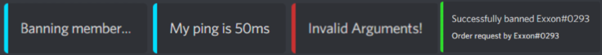

<div style="text-align:center"><a href="https://discord.gg/jUNbV5u"></a></div>

<br> 

<div style="text-align:center">
<a href="https://discord.com/invite/jUNbV5u"></a>
<a href="https://www.npmjs.com/package/cdcommands"></a>
<a href="https://www.npmjs.com/package/cdcommands"></a>
<a href="https://www.npmjs.com/package/cdcommands"></a>
<a href="https://github.com/CreativeDevelopments/CDCommands"></a>
</div>

<br> 

# Contents
- [Installation](#installation)
- [Setup](#setup)
- [Creating a Command](#creating-a-command)
    - [Properties](#properties)
    - [Command](#command)
- [Creating an Event](#creating-an-event)
    - [Custom Message Event](#custom-message-event)
- [Message.json](#message-json)
- [Defaults](#defaults)
    - [Embeds](#embeds)
    - [Logging](#logging)
- [Functions](#functions)
- [Other](#other)

<br> 

# Installation
We recommend that if you are going to use the mongoose package to install version 5.11.15, you can do this with this command below:
```
npm i cdcommands --save
npm i mongoose@5.11.15 --save
```

<br> 

# Setup
```js
const Discord = require('discord.js');
const CDCommands = require('cdcommands');
require('dotenv').config() // If you a using dotenv you need to install it with "npm i dotenv --save"

const client = new Discord.Client();

client.on('ready', () => {
    new CDCommands(client, {
        commandsDir: 'commands',
        eventsDir: 'events', 
        MessageJSONPath: "./path/to/message.json", // You can get the default message.json from our GitHub
        testServers: [], // Array of your test servers, these will be the servers that the testOnly: true commands work in
        devs: [], // Array of your bot developers IDs
        defaultPrefix: 'prefix',
        mongoURI: process.env.MONGO_URI, 
        cacheUpdateSpeed: 60000 * 5 , // Needs to be a number, this example would be 5 minutes
        customHelpCommand: false, // Boolean
        customMessageEvent: false, // Boolean
    })
})

client.login(process.env.TOKEN)
```

<br> 

# Message JSON
Setting up your message.json file is as easy as creating the file in your directory and adding the relative path in the MessageJsonPath property. On the first start of the project, a directory and file will be created, "~.vscode/settings.json". This is created to allow for autocomplete in your message.json files. You can get the default message.json file [here, from our github.](https://github.com/CreativeDevelopments/CDCommands/blob/main/src/Base/message.json)

```js
client.on("ready", () => {
  new CDCommands(client, {
    MessageJSONPath: "./path/to/message.json",
    ...
  });
});
```

<br> 

# Creating a Command

Commands can have as many subfolders as you want.

## Properties:
```
name --> Name of command | String  

aliases --> Different names the command can be run by | Array 

description --> Brief description of what the command does | String  

details --> More detailed description of the command, this appears on the "{prefix}help CommandName" help menu | String 

minArgs --> Minimum Arguments Required | Number 

maxArgs --> Maximum Arguments for a command | Number, use Infinite for no limit

usage: --> How to use the command, add "{prefix}" to the start | String 

guildOnly: --> If the command should only work in guilds | Boolean  

dmOnly --> If the command should only work in Direct Messages | Boolean  

testOnly --> If the command should only work in the test servers specified in your main file | Boolean  

devOnly --> If the command should be restricted to only the developers specified in your main file | Boolean  

nsfw --> If the command should only work in NSFW channels | Boolean  

cooldown --> If the user running the command should have a cooldown | Number 

globalCooldown --> A cooldown across all servers | Number  

noDisable --> If the command should not be able to be disabled | Boolean  

userPermissions --> Array of permissions a user needs to run a command | Array  

botPermissions --> Array of permissions the client needs to run the command | Array  

category --> Category of the command | String  
```  

## Command  

```js
// File name: "ping.js"

const { Command } = require('cdcommands');

module.exports = new Command({
    name: 'ping',
    aliases: ['pong'], // Optional
    description: 'Tells you the bots ping',
    details: 'More information', // This will be displayed when doing {prefix}help <Command Name>
    minArgs: 0,
    maxArgs: 0, // Use Infinity for infinite
    usage: '{prefix}ping',
    guildOnly: false,
    dmOnly: false,
    testOnly: false,
    devOnly: false,
    nsfw: false,
    cooldown: 0, // Optional - Defaults to 0 - In ms
    globalCooldown: 0, // Optional - Defaults to 0 - In ms
    noDisable: true,
    userPermissions: ['MANAGE_MESSAGES'], // Optional
    botPermissions: ['SEND_MESSAGES'], // Optional
    category: 'Misc',
    run: async({ message, args, client, prefix }) => {
        message.reply('Pong')
    }
})
```
<br> 

# Creating an Event

Events can have as many subfolders as you want. If you want to create a message event you need to enable "customMessageEvent" when 

```js
// File name: guildMemberAdd.js

const { Event } = require('cdcommands')

module.exports = new Event('guildMemberAdd', (client, member) => {

    console.log(`${member.user.tag} just joined the server!`)
    
})
```

<br> 

## Custom Message Event
If you want to have our own message event you will need to set `customMessageEvent: true` in your main file. I'd suggest taking the default message event from [here](https://github.com/CreativeDevelopments/CDCommands/blob/main/src/Base/Message.js) and changing this. 

<br>

# Defaults

## Embeds
There are 4 different embeds - load, error, success and info:

Example:
```js
//File name: example.js

run: ({ message, client }) => {
    message.channel.send("", { embed: client.error({ msg: message, data: 'Invalid Arguments!' })})

    message.channel.send("", { embed: client.info({ msg: message, data: 'My ping is 50ms' })})

    message.channel.send("", { embed: client.load({ msg: message, data: 'Banning member...' })})

    message.channel.send("", { embed: client.success({ msg: message, data: 'Successfully banned Exxon#0293' })})
}
```
<div style="text-align:center">

</div>

<br>

## Logging
There are 5 different default logs - ready, info, load, database, error and warn:

Example:
```js
client.logReady({ data: 'Logged in as Test Bot#8673' })
client.logInfo({ data: 'CDCommands >> Loaded 71 commands' })
client.logWarn({ data: 'You have not set your MongoURI' })
client.logError({ data: 'Failed to connect to the database' })
client.logDatabase({ data: 'Successfully connected to the database' })
```
<div style="text-align:center">

</div>

<br> 

# Functions

There is currently only one main function but more will be added in the future. 

```js
// File name: test.js
// Directory: ./commands/general/test.js
// This will be changed so you can do const { ProperCase } = require('cdcommands') soon.

const { Command } = require('cdcommands')
const { ProperCase } = require('cdcommands/src/Functions')

module.exports = new Command({
    name: 'test',  // Fill out the rest as normal
    run: ({ message }) = { 
        console.log(ProperCase('hello world')) 
    }
})

// Console Log:
Hello World
```

<br> 

# Other
If you have any questions, suggestions or need helping setting it up join our [Support Server](https://discord.gg/jUNbV5u).  

Stuff we are adding
<ul>
    <li>Default tickets with a ticket config command</li>
    <li>A way to have premiumOnly commands</li>
    <li>A default block command so you can block user Id's from using your bot</li>
</ul>

